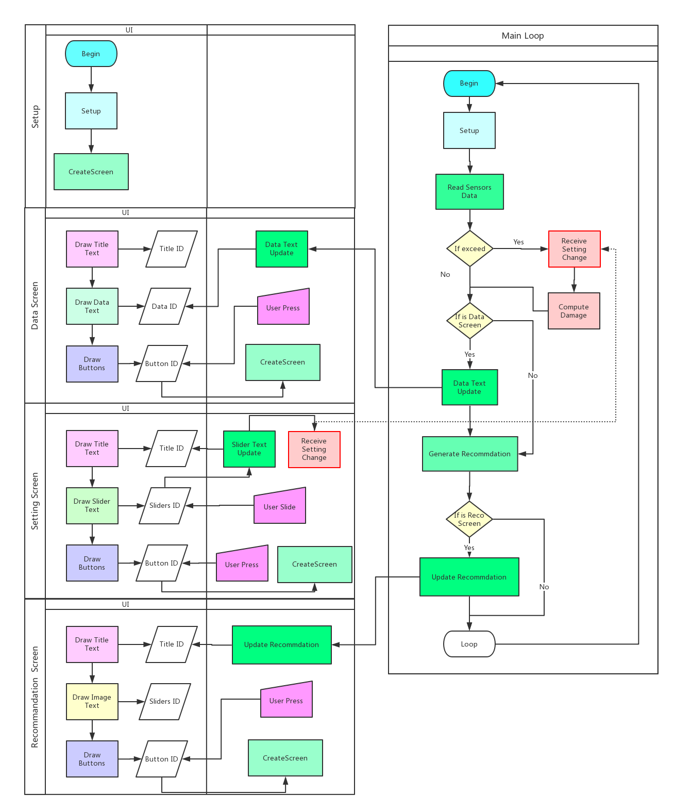

# SensorSolution17

The project aims to develop a wearable device to detect the exposure to the Ultraviolet and polluted air of the people who wears this device, and to alarm them when they have been exposed to dangerous amount of UV or air pollution. Besides, through wireless communication, the device can transmit data to smartphones, PCs or Cloud platforms, where data can be organized and analyzed.

In March 2017, We have completed an integrated prototype of wearable device for ultraviolet radiation and air pollution as well as a smart phone App that work with the device. Arduino MKR1000 is utilized as the MCU. The sensor parts are ML8511 for UV, and GP2y1010AU0F for dust. For the power module, LiPo Battery is connected to the MCU, on which there is a circuit for battery charging connected with an external wireless charging module. The App is built on Blynk IoT Platform, which allows users to design IoT application GUI by adding codes and wadgets. This prototype can send sensors data to two servers: Blynk server for App and Samsung Artik server for data display. In addition, parameters can be set in the smart phone App and be sent to the device. 

Before May 2017, we have completed an integrated prototype of wearable device for ultraviolet radiation and air pollution as well as an smart phone App that work with the device. Unlike the prototype of the last quarter, this device is based on Bluetooth Low Energy(BLE). Simblee Lilypad is utilized as the MCU. The sensor parts are ML8511 for UV, and MQ2 for air pollution. For the power module, LiPo Battery is connected to the MCU, on which there is a circuit for battery charging connected with an external wireless charging module. The App is built on Simblee IoT Platform, which allows users to design IoT application GUI by adding codes and wadgets. This prototype can send sensors data directly to the smartphone for data display. In addition, parameters can be set in the smart phone App and be sent to the device. In addition, comparison has been done between BLE prototype and last quarter’s Wi-Fi prototype.

## Abstract 
Albeit apropos sunshine benefits people’s health, there is authoritative convention that Ultraviolet radiation from sun exposure is the primary environmental cause of the skin cancer. Air pollution is another outdoors component that impairs people’s health, and is increasingly serious in industrial areas. As a solution to monitor the exposure to the Ultraviolet and polluted air, several new wearable prototype devices have been recently developed which aim to alarm people when they have been exposed to dangerous amount of UV or air pollution. Those devices, with commercially available sensors and microcontrollers, are designed to transmit sensors data to a smartphone for display and analysis through Wi-Fi or Bluetooth Low Energy. Portable smart phone Apps based on the emerging Internet-of-Things platforms are also developed to work with the wearable devices, providing the user interface control, personalized recommendations and alerts notification to users when the appropriate level of outdoor activities is reaching the allowable threshold based on ultraviolet index (UVI), air quality index(AQI), volatile organic compounds, exposure time and skin color. Our notification system, integrated with miniaturized wearable sensors and smartphone Apps, offers some new functionality such as wireless sensors data accessibility, personalized alert setting and friendly user interface compared to current commercial products.

Keywords: UV Radiation, Air Pollution, Wireless Sensing

## System Structure 

